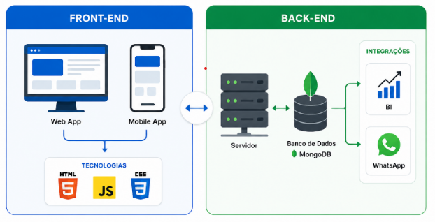
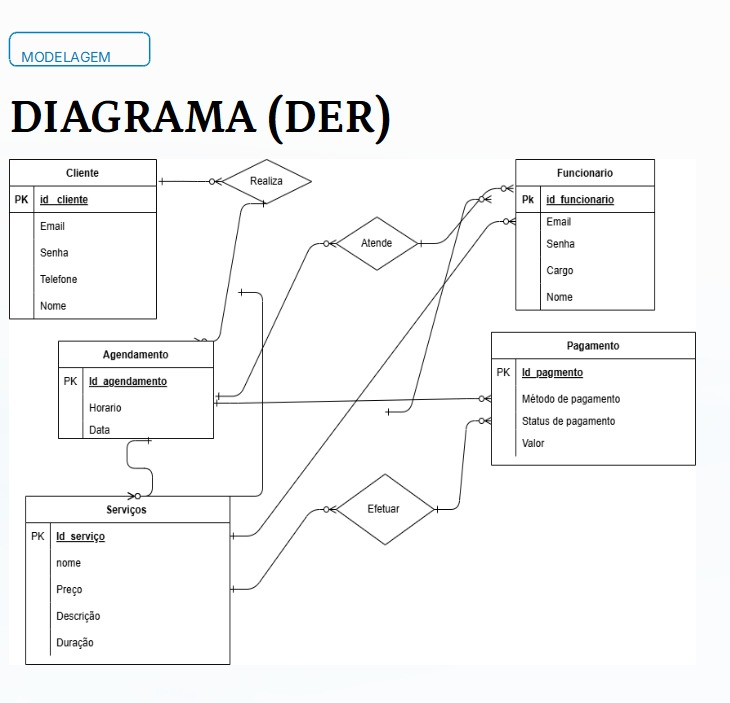
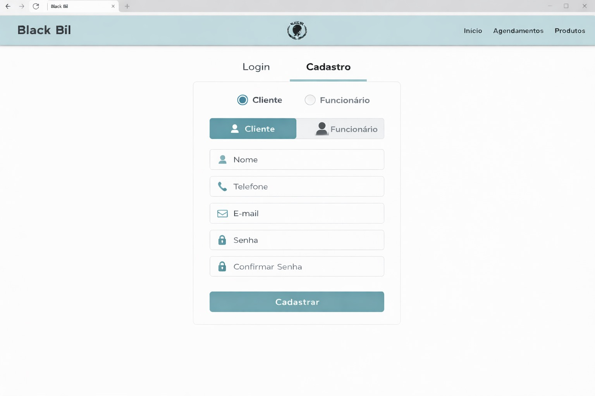

# 4. Projeto da Solução

> ⚠️ **Aviso aos Squads (Software House)**
>
> Esta seção **não deve ser preenchida integralmente antes da codificação**.
> Trata-se de um **Documento Vivo**, que deverá ser atualizado **incrementalmente a cada Sprint**, refletindo fielmente o código real implementado.

---

## 4.1 Arquitetura da Solução (Sprint 1 e 2)

Apresente um **diagrama macro** demonstrando como os componentes do sistema se comunicam.

A arquitetura deve refletir o modelo de **fatias verticais**, evidenciando o fluxo:

**Front-end → API (Back-end) → Banco de Dados**

Semelhante à imagem abaixo:




 **Fonte:** [Guia Completo de Desenvolvimento de Software - UDS](https://uds.com.br/blog/desenvolvimento-de-software-guia-completo/) <br><br>
 
 ### 📎 Inserir o Diagrama de Arquitetura do Projeto do Grupo
🚨 O grupo deverá inserir aqui a imagem


---
🔧**Ferramentas recomendadas:**
- Draw.io
- Lucidchart
- Figma

---

## 4.2 Tecnologias Utilizadas (Sprint 1)

Descreva as tecnologias, linguagens, frameworks, bibliotecas e serviços escolhidos pelo Squad.

| Dimensão | Tecnologia Escolhida |
|----------|----------------------|
| Banco de Dados (SGBD) | MongoDB |
| Back-end (API) | Ex: C# (.NET Core) |
| Front-end / Mobile | HTML + CSS + JavaScript|
| Hospedagem / Deploy | Ex: Azure, AWS, Render ou Railway |
| Gestão e Versionamento | GitHub e GitHub Projects (Kanban) |

 ⚠️ **Observação:**
 - GitHub Pages não executa back-end.
 - Utilize apenas tecnologias realmente implementadas.

---

##  4.3 Wireframes ou Mockups (A partir da Sprint 2)

Apresente os protótipos das telas (Wireframes/Mockups) apenas das funcionalidades que estão sendo implementadas na Sprint atual.

Cada Wireframe ou Mockups devem estar associados a pelo menos:

- Um Requisito Funcional (RF-XX)
- Uma História de Usuário


## 📌 Exemplo Ilustrativo – Tela de Cadastro (RF-01)

**História associada:** Como usuário, quero criar uma conta para acessar o sistema.

Representação simplificada do Wireframe:



**Descrição:** A interface contempla todos os campos exigidos pelo RF-01 e permite persistência no banco após validação no backend.

---
🔧 **Ferramentas sugeridas:**
- Figma  
- MarvelApp  
- Balsamiq  
---

### 📎 Inserir AQUI Wireframes/ Mockups do Projeto de Software

🚨 O grupo deverá inserir aqui a imagem


---

## 4.4 Modelagem de Dados (Sprint 2 e 3)

O sistema exige persistência de dados.

A documentação do banco seguirá a abordagem de **entrega contínua**, sendo expandida conforme evolução do projeto.

---

### 4.4.1 Script Físico (Entrega na Sprint 2 - MVP)

Para a primeira fatia vertical (MVP), o Squad deverá entregar o **script de criação das tabelas ou coleções utilizadas**.

#### 🔹 Para Banco Relacional (SQL)

Incluir:

- Comandos `CREATE TABLE`
- Definição de chave primária (PK)
- Definição de chaves estrangeiras (FK)

**Exemplo:**

```sql
CREATE TABLE Usuario (
    Id INT PRIMARY KEY,
    Nome VARCHAR(100),
    Email VARCHAR(150) UNIQUE,
    Senha VARCHAR(200)
);
```

---

### Para Banco NoSQL

Incluir a estrutura dos documentos JSON (Schema).

**Exemplo:**
blackbill_db
│
├── clientes
├── barbeiros
├── servicos
├── agendamentos
└── pagamentos

use blackbill_db

db.createCollection("pagamentos")

db.pagamentos.insertMany([

{
    agendamentoId: ObjectId(),
    valor: 45.00,
    formaPagamento: "pix",
    status: "pago",
    parcelas: 1,
    observacao: "Pagamento realizado via Pix",
    dataPagamento: new Date(),
    createdAt: new Date(),
    atualizadoEm: new Date()
},

{
    agendamentoId: ObjectId(),
    valor: 25.00,
    formaPagamento: "dinheiro",
    status: "pago",
    parcelas: 1,
    observacao: "Pagamento realizado em dinheiro",
    dataPagamento: new Date(),
    createdAt: new Date(),
    atualizadoEm: new Date()
},

{
    agendamentoId: ObjectId(),
    valor: 60.00,
    formaPagamento: "cartao_credito",
    status: "pendente",
    parcelas: 2,
    observacao: "Pagamento parcelado",
    dataPagamento: null,
    createdAt: new Date(),
    atualizadoEm: new Date()
}

])

### 📁 Obrigatório

O arquivo .sql ou .js deve ser salvo na pasta: src/bd

 - É permitido colar um trecho do script no README apenas para visualização rápida.
 
---
### 4.4.2 Representação do Modelo Físico de Dados (Entrega na Sprint 3 - Core)


> **Fundamentação:** Os modelos de dados físicos fornecem detalhes minuciosos que auxiliam administradores e desenvolvedores na implementação da lógica de negócios em um banco de dados real.
> Eles incluem elementos não especificados no modelo lógico, como:
> - Tipos de dados específicos da plataforma
> - Restrições
> - Índices
> - Triggers (quando aplicável)
> - Procedimentos armazenados (quando aplicável)
>
>Por representarem um banco real, devem respeitar:
> - Convenções de nomenclatura
> - Restrições da plataforma
> - Uso adequado de palavras reservadas <br>


**Exemplo:**


**FONTE:** <https://aws.amazon.com/pt/compare/the-difference-between-logical-and-physical-data-model/>

<br>O grupo deverá gerar um diagrama físico do banco de dados (estrutura real das tabelas), evidenciando PKs, FKs e relacionamentos, conforme implementado no código.

Este modelo deve exibir:
- Tabelas ou coleções existentes
- Atributos com seus respectivos tipos de dados
- Chaves Primárias (PK)
- Chaves Estrangeiras (FK)
- Relacionamentos entre tabelas
- Restrições implementadas (quando aplicável)

---

### 📌 Requisitos Obrigatórios

- O diagrama deve representar fielmente o banco já implementado.
- Deve refletir exatamente o que foi criado nas Sprints 2 e 3.
- Não incluir tabelas que não existam no código.
- Deve contemplar o controle de acesso de usuários, quando implementado.
- Deve respeitar as convenções e restrições da plataforma utilizada.

---

### 📎 Representação do Modelo Físico de Dados
🚨 O grupo deverá inserir aqui a imagem do diagrama físico de dados.

---
🔧**Ferramentas Sugeridas**
- MySQL Workbench (engenharia reversa automática)
- DbDesigner
- Lucidchart
